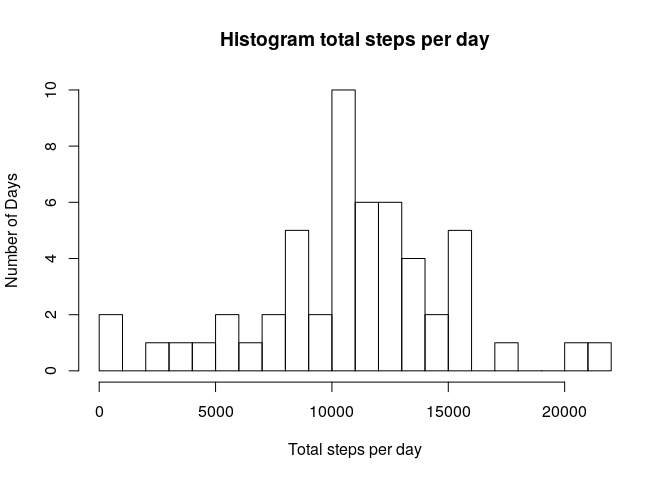

## 1) Loading and preprocessing the data


```r
activity <- read.csv( unzip("activity.zip",file = "activity.csv"))
summary(activity)
```

```
##      steps                date          interval     
##  Min.   :  0.00   2012-10-01:  288   Min.   :   0.0  
##  1st Qu.:  0.00   2012-10-02:  288   1st Qu.: 588.8  
##  Median :  0.00   2012-10-03:  288   Median :1177.5  
##  Mean   : 37.38   2012-10-04:  288   Mean   :1177.5  
##  3rd Qu.: 12.00   2012-10-05:  288   3rd Qu.:1766.2  
##  Max.   :806.00   2012-10-06:  288   Max.   :2355.0  
##  NA's   :2304     (Other)   :15840
```


## 2) Total number of steps taken per day

```r
total_steps_day <- tapply(activity$steps,activity$date,sum)
hist(total_steps_day [!is.na(total_steps_day)],breaks = 30, main = "Histogram total steps per day", xlab = "Total steps per day",ylab = "Number of Days")
```

<!-- -->

## 3) Median number of steps taken each day

```r
steps_median <- median(tapply(activity$steps,activity$date,sum,na.rm = TRUE))
steps_median
```

```
## [1] 10395
```
The median is 0 steps for all measured days, because it is the most frequent result. This result is also reasonable considering that the average person ussually walks for short periods of time. 

## Mean number of steps taken each day

```r
steps_mean <- mean(tapply(activity$steps,activity$date,sum, na.rm = TRUE))
steps_mean
```

```
## [1] 9354.23
```

## 4)Time series plot of average number of steps taken

```r
interval_mean <- tapply(activity$steps,activity$interval,mean, na.rm = TRUE)
plot(as.integer(names(interval_mean)),interval_mean, main = "Time series plot of the mean number of steps taken", ylab = "Mean", xlab = "Minutes",type = "l")
```

<!-- -->
## 5) 5-minute interval with the maximum number of steps


```r
act_interval <- tapply(activity$steps, activity$interval, median, na.rm = TRUE)
max_number_steps <- as.integer(names(which.max(act_interval)))
max_number_steps
```

```
## [1] 845
```
835 is the time interval with the highest number of mean steps.

## 6) Code to describe and show a strategy for imputing missing data. 


Missing values:

```r
Number_na <- sum(is.na(activity$steps))
Number_na
```

```
## [1] 2304
```
Missing values were solved by inference, it is known that time of the day, day of the week and month can have an effect on the person's routine, so it is justified to group by those variables, to calculate the median number of steps and to use that result to fill the missing values. The median was used instead of the mean, since the median is more robust towards extreme values. A new dataset "activity1" was created. 

Create new rows with the month and the day of the week.


```r
library(lubridate)
```

```
## 
## Attaching package: 'lubridate'
```

```
## The following objects are masked from 'package:base':
## 
##     date, intersect, setdiff, union
```

```r
activity1 <- activity
activity1$dayofweek <- wday(activity1$date)
```

```
## Warning: tz(): Don't know how to compute timezone for object of class factor;
## returning "UTC". This warning will become an error in the next major version of
## lubridate.
```

```r
activity1$month <- month(activity1$date)
```

```
## Warning: tz(): Don't know how to compute timezone for object of class factor;
## returning "UTC". This warning will become an error in the next major version of
## lubridate.
```

```r
na_fill <- tapply(activity1$steps, list(activity1$dayofweek, activity1$month, activity1$interval), median, na.rm = TRUE )
```
Once the median steps per day of week, month and interval had been calculated; the "na" in the "steps" column were completed with those medians.  


```r
rows_to_fill <- which(is.na(activity1$steps))

for(i in rows_to_fill){
        activity1$steps[i] <- na_fill[activity1$dayofweek[i],as.character(activity1$month[i]),as.character(activity1$interval[i])]
  
}

sum(is.na(activity1$steps))
```

```
## [1] 0
```
This proves that the new "steps" column has none "NA". 

## 7) Histogram of the total number of steps taken each day after imputing missing values. 


```r
total_steps_day_filled <- tapply(activity1$steps,activity1$date,sum)

hist(total_steps_day_filled,breaks = 30, main = "Histogram total steps per day", xlab = "Total steps per day")
```

<!-- -->
With the "NA" filled, there is a slight observable increase in the frequency of some baskets in the <5000 steps/day region. 

New median:


```r
steps_median1 <- median(tapply(activity1$steps,activity1$date,sum))
steps_median1
```

```
## [1] 10395
```

New mean: 


```r
steps_mean1 <- mean(tapply(activity1$steps,activity1$date,sum))
steps_mean1
```

```
## [1] 9903.828
```

## 8) Panel plot comparing average number of steps taken per 5-minutes interval across weekdays and weekends.

```r
activity1$factor_weekday <- as.factor(sapply(activity1$dayofweek, function(x) {if(x %in% 2:6) "weekday" else "weekend"})) 
par(mfrow=c(2,1))
activity_weekday <- subset(activity1, activity1$factor_weekday == "weekday")
activity_weekend <- subset(activity1, activity1$factor_weekday == "weekend")


par(mfrow=c(2,1))

plot( as.integer(names(tapply(activity_weekday$steps,activity_weekday$interval,mean))),tapply(activity_weekday$steps,activity_weekday$interval,mean), type = "l", xlab = "Interval", ylab = "Number of steps")

plot( as.integer(names(tapply(activity_weekend$steps,activity_weekend$interval,mean))),tapply(activity_weekend$steps,activity_weekend$interval,mean), type = "l",xlab = "Interval", ylab= "Number of steps")
```

<!-- -->

